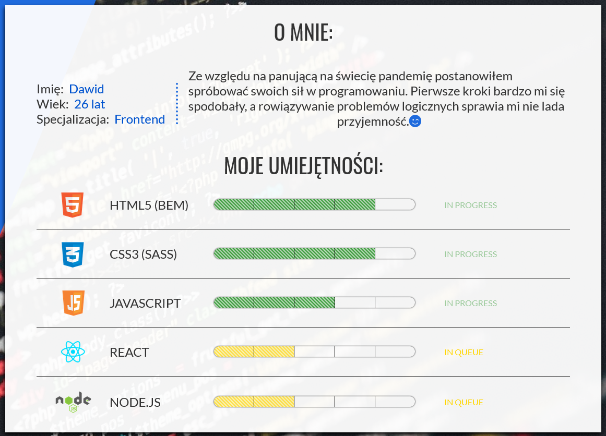
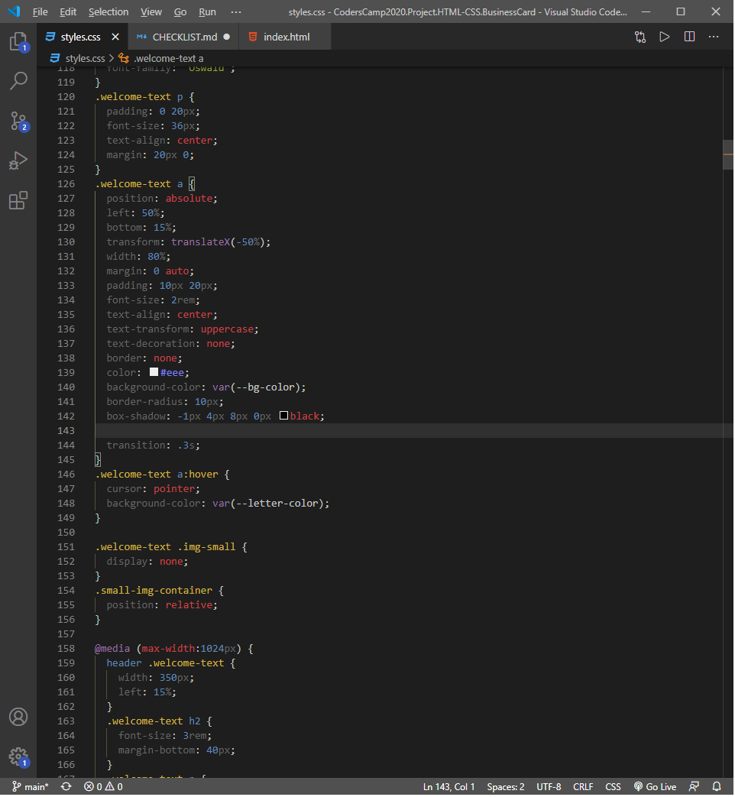
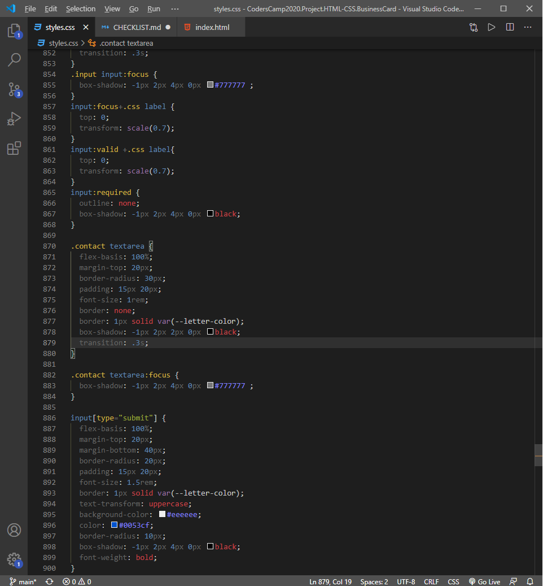
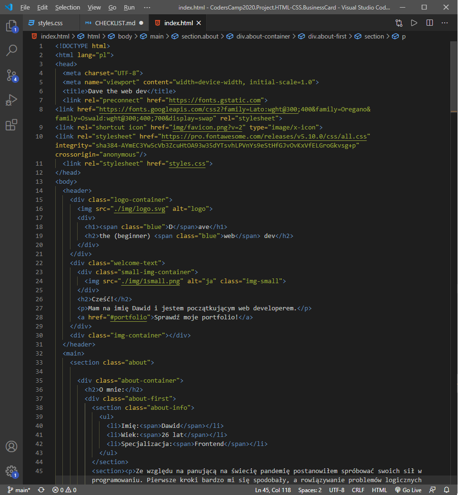
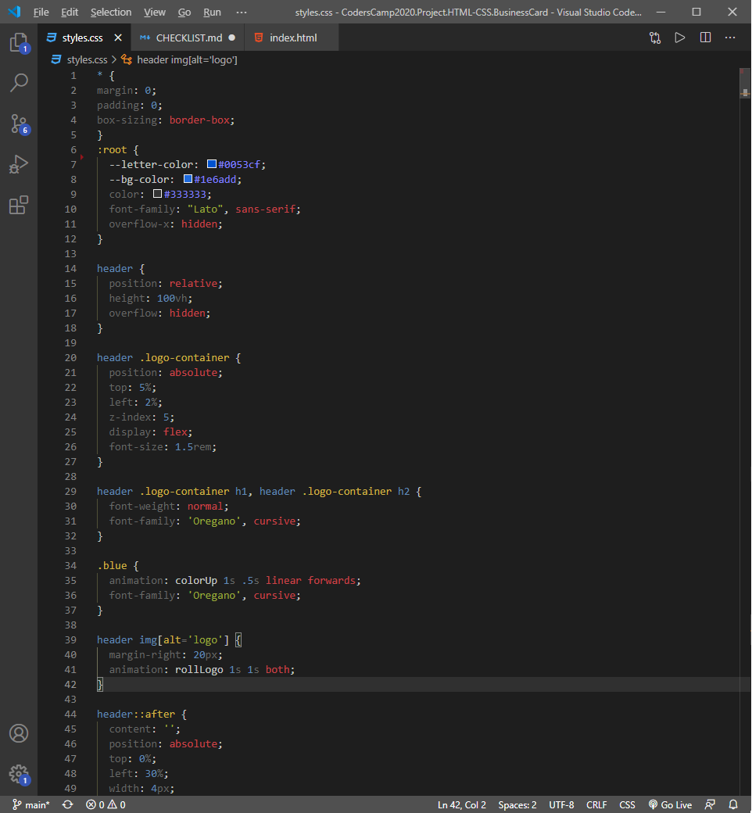
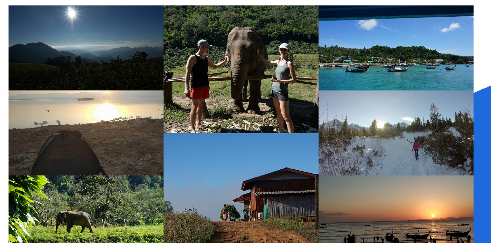
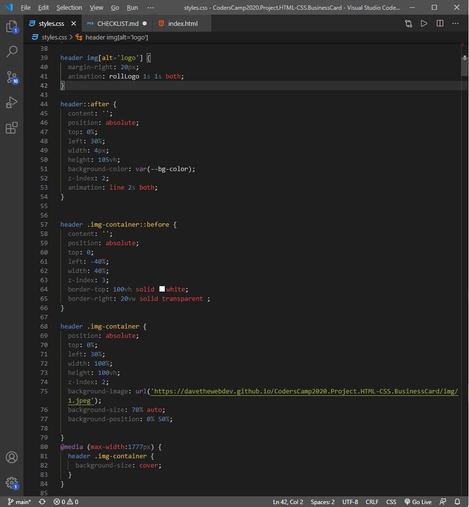
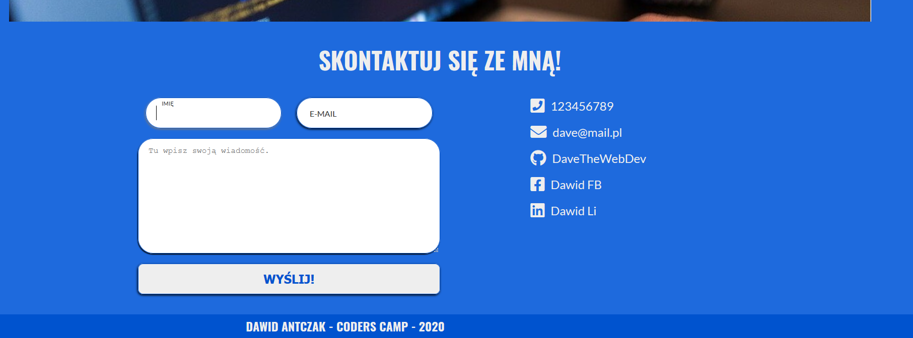

# Portfolio - Dawid Antczak - CodersCamp 2020

## Zagadnienia:
### Box-model
---
W każdej sekcji zostały zastosowane, elementy box-model. Na zdjęciu sekcja "O mnie". Wykorzystano: margin, padding, border, width, height.

### Kaskadowość CSS
---
Kaskadowość została zastosowana np. podczas dodawania pseudoklasy hover lub zastosowania media queries, co jest zilistruowane na poniższym zdjęciu z pliku styles.css

### Selektory CSS
---
W projekcie wykorzystano róznego typu selektory, klasy, atrybuty, pseudoklasy, kombinatory.

### Tagi HTML, podpięcie pliku CSS do HTMla, zewnętrzne ikony/fonty (fontawesome, google fonts).
---
W projekcie użyto całej masy tagów m. in. header, main, h1, h2, h3, article, section, img, div, etc. Plik CSS został podpięty przed znacznikiem zamykającym head. Zewnętrzne ikony i fonty zostały podpięte również w head. 

### Zapisywanie kolorów
---
Kolory zapisano w systemie szesnastkowym w pseudoelemencie :root pod postacią zmiennych, żeby można było w przyszłości łatwo edytować projekt. 

### Stylowanie tekstu
---
Tekst został ostylowany przy użyciu różnych właściwości font-size, font-weight, text-decoration, font-family, text-align, text-transform, color, etc.

### Flexbox i grid
---
W projekcie użyto obie właściwości, do mniej skomplikowanych elementów użyto flexbox, np. w sekcji "O mnie". Grid został wykorzystany tylko w galerii w sekcji "Hobby"

### Position (absolute, relative) i animacje keyframes
---
Header jest doskonałym przykładem użycia tych właściwości :)
 

### Formularz
---
Na końcu strony umieszczony jest formularz. Najbardziej jestem zadowolony z label'i, które po kliknięciu zmieniają swoją wielkość nie używając do tego celu JS :)
 

### RWD
---
Ten aspekt został zrealizowany poprzez media queries ustawionych na najpopularniejsze rozdzielczości telefonów.
